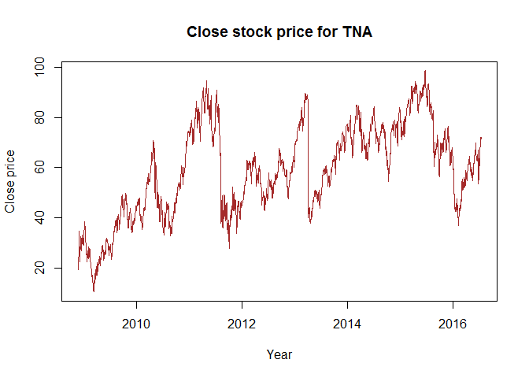
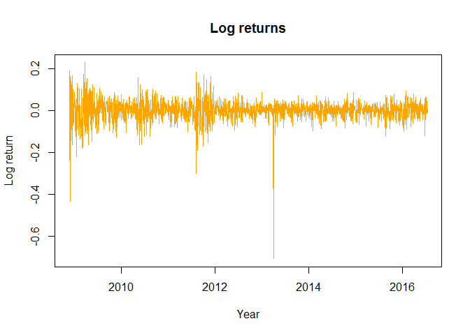
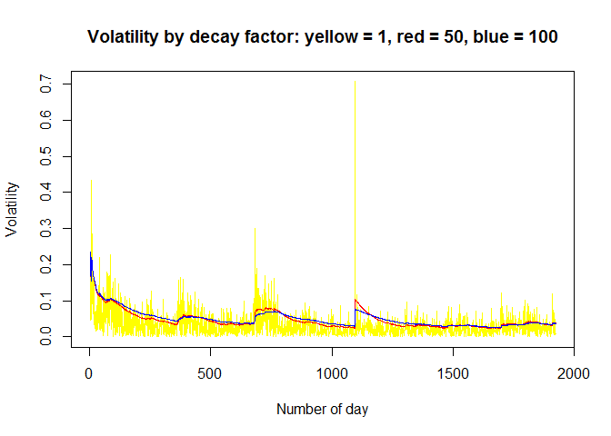
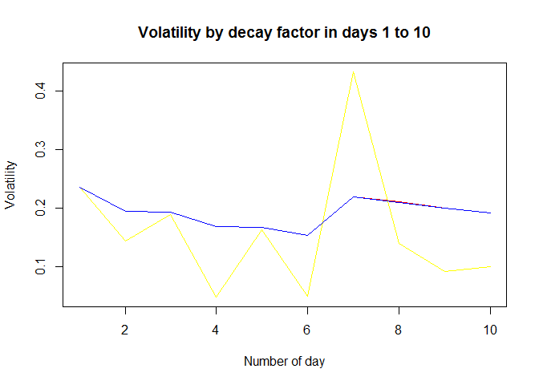
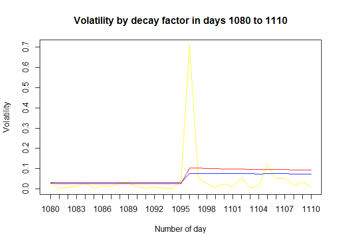

# U9 Case
Jose Q  
14 de julio de 2016  


```
## Warning: package 'tseries' was built under R version 3.3.1
```


### Selected quote: Direxion Daily Small Cap Bull 3X (TNA)  

* Source: http://finance.yahoo.com/quote/TNA 


```
## time series starts 2008-11-19
```

<!-- -->

<!-- -->

```
## [1] "The mean log return is  0.000565680861231762  which is an average win of  1.00056584088882"
```

```
## [1] "The biggest change in a single day from  85.730003  in  2013-04-01  to  42.27  in  2013-04-02"
```


```
## [1] "The volatility is  77.7268525986331"
```


<!-- -->


```
## [1] "Decay factor =  1 , the maximum volatility was in day  1096   2013-04-01  due to a change in stock price from  85.730003  to  42.27 ."
```

```
## [1] "Decay factor =  50 , the maximum volatility was in day  1   2008-11-19  due to a change in stock price from  24.23  to  19.139999 ."
```

```
## [1] "Decay factor =  100 , the maximum volatility was in day  1   2008-11-19  due to a change in stock price from  24.23  to  19.139999 ."
```

```
## [1] "The volatility in day 1  2008-11-19  is  0.235811201050232  using the 3 different decay factors."
```

```
## [1] "This is because in day 1, there is no previous history that  influences the decay factor."
```

<!-- -->

```
## [1] "From that day on, the plot for decay factors =  50  and  100  tend to decrease and normalize smoothly."
```

```
## [1] "In day  1096   2013-04-01  there is a big change that peaks the plot for decay factor =  1  but not the other normalized plots."
```

<!-- -->

### Conclusion  

#### The stock price for TNA has been very volatile (volatility = 77.73), which means that, in the long term, this stock tends to change its price quite often with changes in log returns.

#### Even the decay factor = 100 shows a more normalized curve, volatility index is higher than other stocks.  

###  


